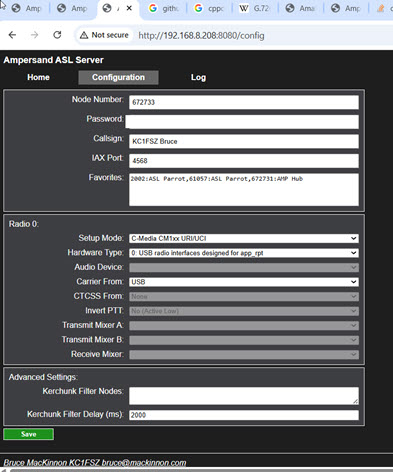
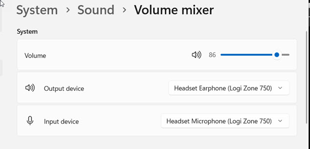
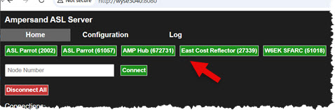
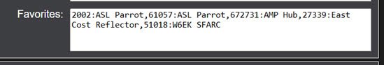

# Ampersand Windows Server User/Install Documentation

At the moment the Ampersand Server provides a basic [All Star Link](https://www.allstarlink.org/) node
for desktop radio-less use. Future releases will enable more functionality. Send
comments/questions to Bruce MacKinnon (KC1FSZ) using the e-mail address in [QRZ](https://www.qrz.com/db/KC1FSZ).

This is experimental work that explores the potential of ASL linking 
without the use of the Asterisk PBX system. [Project documentation is here](https://mackinnon.info/ampersand/). 

All of the testing of this system is happening on:
* Windows 10 and Windows 11 (64-bit)
* LogiTech Logi Zone 750 USB headset

The [change log is located here](../CHANGELOG.md). I try to keep it up to date.

# Credits

Thanks to Frank (KG9M) for his assistance with design and testing of this system.

Network Setup (IPv4)
====================

There are other detailed sources of information about ASL network configuration so 
I won't repeat everything here. It's **no different from what is required 
for Asterisk or the IaxRpt phone**. Bottom line:

* Make sure you are clear on what IAX (UDP) port your node is using. This assignment
happens on the [ASL Portal](https://www.allstarlink.org/portal/servers.php). UDP port 4569 is the common default.
* Make sure that your IAX port is properly configured on the Ampersand Configuration 
screen (see below).
* If you expect to receive inbound calls make sure that your IAX port is opened/forwarded through your firewall/NAT system.
* If you expect to receive inbound calls make sure that your IAX port is opened on any Windows firewall tools that are running on your machine (if applicable).
* You can test your network connection using the 61057 parrot. If the 61057 parrot
tells you that your "network test succeeded" that means that your firewall is open
and that you can accept inbound calls.

Network Setup (IPv6)
====================

(To follow shortly)

Installation Instructions (Windows)
===================================

Download the latest package from here: [https://ampersand-asl.s3.us-west-1.amazonaws.com/releases/amp-win-20260216-x86_64.zip](https://ampersand-asl.s3.us-west-1.amazonaws.com/releases/amp-win-20260216-x86_64.zip).

Unzip the .zip file in convenient location.

Running the Server (Windows)
============================

Shut down any other AllStar servers that use the same IAX port number or ASL node number.

Open a command window and run the Ampersand.exe executable. This is a console application.

Point you browser to http://127.0.0.1:8080 to see the user interface (or other port
if you have changed the default).

These command-line options can be used if you want to override defaults:

* --httport (defaults to 8080).  Used to change the port that the web UI runs on.
* --httppwd (defaults to none).  Used to set the password for access to the web UI. Username
is always **user**.  Please pay attention to shell quoting rules when using passwords that 
contain special characters.
* --config (defaults $USERPROFILE/amp-win.json). Used to change the location of the configuration file.
* --trace Used to turn on extended network tracing.

The --httppwd option us useful in cases where the Ampersand server is running 
on an insecure network. The command would look like this:

    Ampersand --httppwd secret123

Setup/Configuration (Windows)
============================

Press the "Configuration" tab at the top of the screen to get to the configuration screen
that looks like this:

This configuration should be very consistent with that used on the ASL system. Fill 
in your node number, password, and IAX port number. All other defaults should be enough to get you started.

> [!IMPORTANT]
> At the moment there is no support for selecting audio input/output devices on the 
configuration screen. Ampersand will use whatever has been selected as the "master"
at the time the Ampersand Server is started. If you change the settings in Windows
you will likely need to restart the Ampersand Server.

Here's what my settings look like in the Windows control panel:

### Favorites Configuration

A user-defined list of frequently-called nodes can be configured. 

This list is entered on the Configuration Tab. The list should be comma-separated
with a colon between the node number and text description.  For example:

    2002:ASL Parrot,61057:ASL Parrot,672731:AMP Hub,27339:East Cost Reflector,51018:W6EK SFARC

Be sure to press "Save" at the bottom of the screen after making a configuration change.

Network Debugging Hints
=======================

* Pay close attention to the UDP port number you are using. Each ASL Node 
number is associated with an ASL Server. Each ASL Server is assigned a 
UDP port for IAX traffic. Sometimes people get confused about this when they
start running multiple nodes.
* Just because your node can call out doesn't mean that you can accept 
calls. The firewall/NAT adjustments described above aren't required to 
make outgoing calls - only to receive incoming ones.
* A valid ASL registration is required for some nodes to accept your call.
*ASL parrots often do not require registration* so if you find that your
call is accepted by a parrot but not by other nodes it is likely that your 
registration is invalid. Check your password.
* The ASL registration process takes some time to propagate. When your node
first starts up your calls may not be accepted. Wait about 10 minutes and try again.
* Test using parrot 61057 **before asking for network help**. This parrot will provide 
information about whether (a) your node is registered and (b) whether your 
node is reachable from the outside.

Audio Level Hints
=================

Setting audio levels can be tricky because of the many variables involved. There
are two things that need to be adjusted.

**The audio that you send to the AllStar network** which comes from either (a) your 
radio receiver or (b) your microphone on a radio-less node. This level is displayed
on the "USB RX" line of the level meter on the Home tab. It is important to adjust 
your node to avoid clipping of this audio. A good target is around -6dBFS peak.

**The audio that you receive from the AllStar network** which is sent to either (a)
your radio transmitter or (b) your speaker on a radio-less node. This level is 
displayed on the "USB TX" line of the level meter on the Home tab. It is important
to adjust your system to avoid excessive deviation on a transmitter. 

Use the 61057 parrot to test audio and get feedback on your level. Good receive audio
should peak around -6dB. 

> [!NOTE]
> The terminology can be counter-intuitive to users of radio-less nodes
since they typically think of the audio that comes from their microphone as "transmit" 
audio. Keep in mind that the terms are defined from the perspective of a radio-connected
system. When you key the microphone on a radio-less node the level being displayed
is what is being **received** from the microphone connection.

Work In Process (Windows)
=========================

_NOTE: I'm not an expert on Windows software distribution so any input will
be appreciated!_

* Implement the stats API so that the node shows up on the ASL stats page like this: [https://stats.allstarlink.org/stats/51018)](https://stats.allstarlink.org/stats/51018).
* Provide instructions for making a Windows Service for people who want to leave
the server running all the time.
* Write the log to a file in a good location.
* Create a more sophisticated way to select audio input/output devices.

Asking For Help
===============

I'm happy to take any questions, but keep in mind that I'm not an expert on
Windows administration.

Please **do not** post questions that are specific to the Ampersand Server on the [AllStarLink Community Forum](https://community.allstarlink.org/). That forum
is friendly and is very useful for general AllStarLink questions, but they are
primarily focused on supporting the Asterisk/app_rpt based software.

